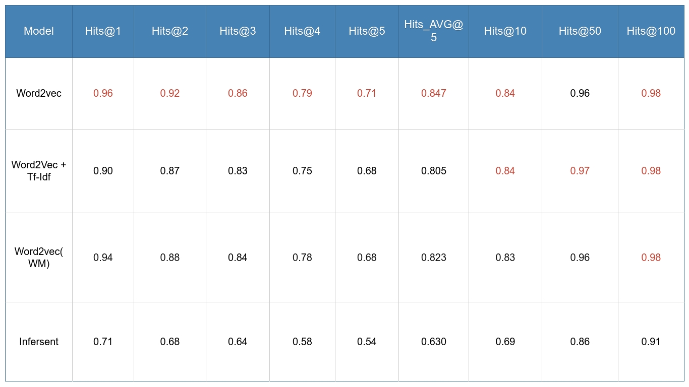
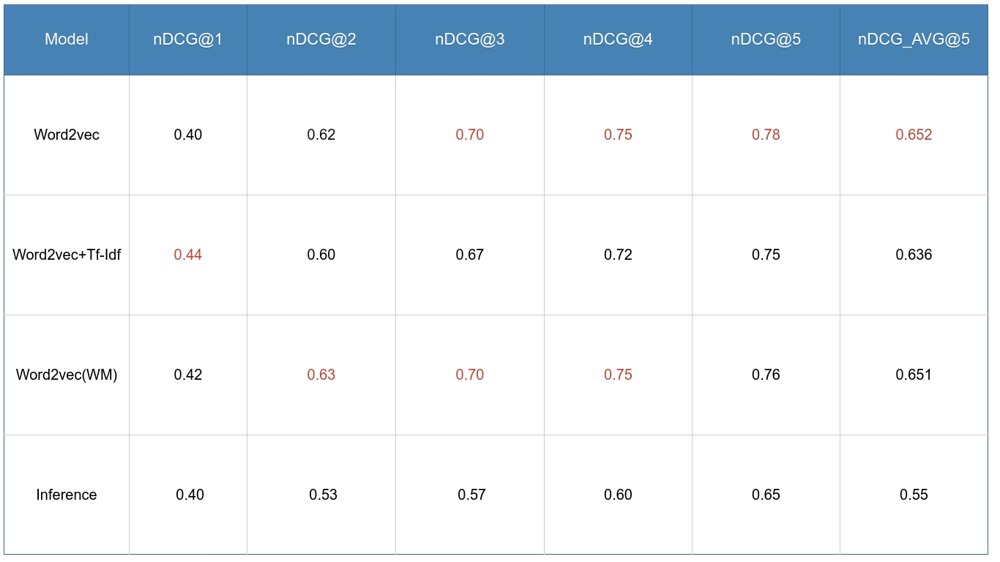

# StackOverflow ML search

I deal with unstructured stackoverflow issues data (~60 000 collected ml related questions). I process it using NLP techniques and do a short data visualization. Then write a model based on Word2Vec's Skip-Gram model to find _k_ the most similar to main query questions and estimate these models on a small test dataset with HitsCount and nDCG scores.

## Notes
There are several interactive plots made with plotly in the notebook and they don't show on GitHub, but you can use [nbviewer](https://nbviewer.jupyter.org/github/SingularityUrBrain/stackoverflow-ml-search/blob/master/StackOverflowSearch.ipynb) or run it locally in trusted mode to see them all.
## Requirements
To create virtual environment with all dependecies needed for notebook:
### Conda
    conda env create -n ENV_NAME --file environment.yml

### Pip
Create virtual environment using python module [venv](https://docs.python.org/3/library/venv.html), [pipenv or virtualenv](https://docs.python-guide.org/dev/virtualenvs/)
and install packages with the following command:

    pip install -r requirements.txt

## Results
For more details about metrics see in the notebook.
### Hits scores

### nDCG scores
